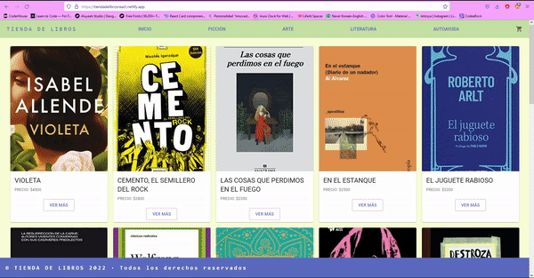

# Tienda de Libros

## Instalación
Para instalarlo podes clonar el repositorio
`$ git clone https://github.com/victoriavrobles/tienda_robles.git`

`$ npm install`

## Deploy
Podés visualizar el proyecto [acá](https://tiendadelibrosreact.netlify.app/)

## Objetivo
Crear un ecommerce con React Js como proyecto final para el curso de React Js de CoderHouse.

## Librerías
[Material UI](https://mui.com/): Estilos

## Autor
Desarrollado por Victoria Robles